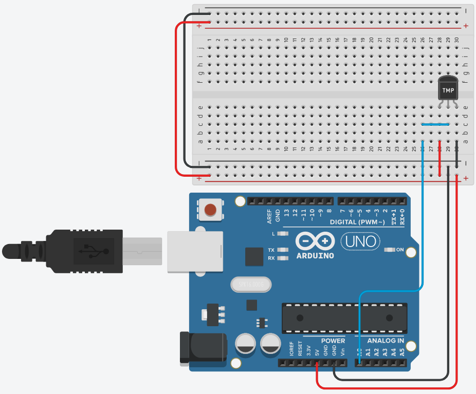

```c
float tmpC = 0;
void setup()
{
  pinMode(A0, INPUT);
  Serial.begin(9600);
}

void loop()
{
  Serial.print("tmpC: ");
  int tmpC = celcius();
  Serial.println(tmpC);
  delay(1000);
}

int celcius()
{
  int reading = analogRead(A0);
  float volts = reading * 5.0;
  volts /= 1024.0;
  tmpC = (volts - 0.50) * 100;
  return tmpC;
}
```