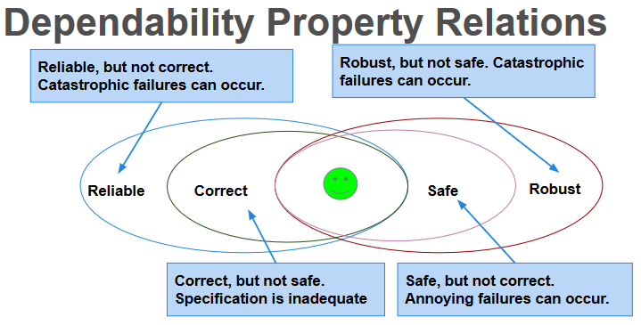

# DIT635 Software Quality and Testing

> study guide

# Lecture 1

# Verification, Validation, and Defects
--- 
 Most relevant for this course: *dependability*
- Ability to consistently offer correct functionality, even under unforeseen or unsafe conditions.

## Quality Attributes
- Performance
  - Ability to meet timing requirements. When events occur, the system must respond quickly.
- Security
  - Ability to protect information from unauthorized access while providing service to authorized users.
- Scalability
  - Ability to “grow” the system to process more concurrent requests.
- Availability
  - Ability to carry out a task when needed, to minimize “downtime”, and to recover from failures.
- Modifiability
  - Ability to enhance software by fixing issues, adding features, and adapting to new environments.
- Testability
  - Ability to easily identify faults in a system.
  - Probability that a fault will result in a visible failure.
- Interoperability
  - Ability to exchange information with and provide functionality to other systems.
- Usability
  - Ability to enable users to perform tasks and provide support to users.
  - How easy it is to use the system, learn features, adapt to meet user needs, and increase confidence and satisfaction in usage.
- Resilience
- Supportability
- Portability
- Development Efficiency
- Time to Deliver
- Tool Support
- Geographic Distribution

### These qualities often conflict.
- Fewer subsystems improves performance, but hurts modifiability.
- Redundant data helps availability, but lessens security.
- Localizing safety-critical features ensures safety, but degrades performance.
- Important to decide what is important, and set a threshold on when it is “good enough”.

> Software is ready for release when you can argue that it is dependable.
> - Correct, reliable, safe, and robust.
> - Shown through Verification and Validation

## Verification and Validation
Activities that must be performed to consider the software “done.”
### Software Verification
> “Are we building the product right?”
The process of proving that the software conforms to its specified functional and non-functional requirements.
- Is the implementation consistent with its specification?
- Does the software work under conditions we set? (usually based on requirements)

Verification is an experiment.
- Perform trials, evaluate results, gather evidence.
- “Specification” and “implementation” are roles.

Usually source code and requirement specification. But also...

- Detailed design and high-level architecture.
- Design and requirements.
- Test cases and requirements.
- Source code and user manuals.

#### Software Testing

- An investigation into system quality.
- Based on sequences of stimuli and observations.
- Stimuli that the system must react to.
- Observations of system reactions.
- Verdicts on correctness.

### Software Validation
---
> “Are we building the right product?”

The process of proving that the software meets the customer’s true requirements, needs, and expectations.

- Does the product work in the real world?
- Does the software fulfill the users’ actual needs?
- Not the same as conforming to a specification.
- If we specify two buttons and implement all behaviors related to those buttons, we can achieve verification.
- If the user expected a third button, we have not achieved validation

## Required Level of V&V
---

### Depends on:
- Software Purpose: The more critical, the more important that it is reliable.
- User Expectations: Users may tolerate bugs because benefits outweigh cost of failure recovery.
- Marketing Environment: Competing products - features and cost - and speed to market.

### When Does V&V Start?
> V&V can start as soon as the project starts.
- Feasibility studies must consider quality assessment.
- Requirements can be used to derive test cases.
- Design can be verified against requirements.
- Code can be verified against design and requirements.
- Feedback can be sought from stakeholders at any time.

## Static Verification
---
> Analysis of system artifacts to discover problems.
- Proofs: Posing hypotheses and making arguments using specifications, models, etc.
- Inspections: Manual “sanity check” on artifacts (e.g., source code), searching for issues.

### Advantages of Static Verification
- One error can hide other errors. Inspections not impacted by program interactions.
- Incomplete systems can be inspected without special code to run partial system.
- Inspection can assess quality attributes such as maintainability, portability, code style, program inefficiencies, etc.

## Dynamic Verification
---
- Exercising and observing the system to argue that it meets the requirements.
- Testing: Formulating sets of input to demonstrate requirement satisfaction or find faults.
- Fuzzing: Generating semi-random input to locate crashes and other anomalies.
- Taint Analysis: Monitoring how faults spread by corrupting system variables.

### Advantages of Dynamic Verification
- Discovers problems from runtime interaction, timing problems, or performance issues.
- Often cheaper than static verification.
  - Easier to automate.
  - However, cannot prove that properties are met
    - Cannot try all possible executions.

## Perfect Verification
> Verification is an instance of the halting problem.
- There is at least one program for which any technique cannot obtain an answer in finite time.
- Testing - cannot exhaustively try all inputs.
- Must accept some degree of inaccuracy.

### Verification Trade-Offs
> We are interested in proving that a program demonstrates property X
- Pessimistic Inaccuracy - not guaranteed to program even if the it possesses X.
- Optimistic Inaccuracy - may accept program that does not possess X.
- Property Complexity - if X is too difficult to check, substitute simpler property Y.

### How Can We Assess Readiness?
- Finding all faults is nearly impossible.
- Instead, decide when to stop V&V.
- Need to establish criteria for acceptance.
  - How good is “good enough”?
- Measure dependability and other quality attributes and set threshold to meet.

#### Product Readiness
- Put it in the hands of human users.
- Alpha/Beta Testing
  - Small group of users using the product, reporting feedback and failures.
  - Use this to judge product readiness.
  - Make use of dependability metrics for quantitative judgement (metric > threshold).
  - Make use of surveys as a qualitative judgement.

#### Ensuring Quality of Successive Releases
- V&V do not end with the release of the software.
  - Software evolves - new features, environmental adaptations, bug fixes.
  - Need to test code, retest old code, track changes.
  - When code changes, rerun tests to ensure tested elements still works.
  - Retain tests that exposed faults to ensure they do not return.

#### Improving the Development Process
- Try to learn from your mistakes in the next project.
  - Collect data during development.
    - Fault information, bug reports, project metrics (complexity, #classes, # lines of code, test coverage, etc.).
  - Classify faults into categories.
  - Look for common mistakes.
  - Learn how to avoid such mistakes.
  - Share information within your organization.

## What was learned.
---

- Quality attributes describe desired properties of thesystem under development.
  - Dependability, scalability, performance, availability, security, maintainability, testability, ...
- Developers must prioritize quality attributes and design a system that meets chosen thresholds.
- Quality is often subjective. Choose a definition, and offer objective thresholds.
- Software should be dependable and useful before it is released into the world.
- Verification is the process of demonstrating that an implementation meets its specification.
  - This is the primary means of making software dependable (and demonstrating dependability).
  - Testing is most common form of verification.

# Lecture 2

# Software Quality
---
- We all want high-quality software.
  - We don’t all agree on the definition of quality.
- Quality encompasses both what the system does and how it does it.
  - How quickly it runs. How secure it is.
  - How available its services are. How easily it scales to more users.
- Quality is hard to measure and assess objectively.

## Quality attribute focus
---
- Dependability
- Availability
- Performance
- Scalability
- Security

---
## Dependability
---
### When is Software Ready for Release?
- Provide evidence that the system is dependable.
- The goal of dependability is to establish four thingsabout the system:
  - That it is correct.

    - A program is correct if it is always consistent with its specification.
    - Depends on quality and detail of requirements.
      - Easy to show with respect to a weak specification.
      - Often impossible to prove with a detailed specification.
    - Correctness is rarely provably achieved.

  - That it is reliable.

    - Statistical approximation of correctness.
    - The likelihood of correct behavior from some period of observed behavior.
      - Time period, number of system executions
    - Measured relative to a specification and usage profile (expected pattern of interaction).
      - Dependent on how the system is used by a type of user.

> Dependence on Specifications
> - Correctness and reliability:
>   - Success relative to the strength of the specification.
>     - Hard to meaningfully prove anything for strong spec.
>   - Severity of a failure is not considered.
>     - Some failures are worse than others.
> - Safety revolves around a restricted specification.
> - Robustness focuses on everything not specified.

  - That it is safe.

    - Safety is the ability to avoid hazards.
      - Hazard = defined undesirable situation.
      - Generally serious problems.
    - Relies on a specification of hazards.
      - Defines what the hazard is, how it will be avoided in the software.
      - We prove or show evidence that the hazard is avoided.
      - Only concerned with hazards, so proofs often possible.

  - That is is robust

    - Software that is “correct” may fail when the assumptions of its design are violated.
      - How it fails matters.
    - Software that “gracefully” fails is robust.
      - Design the software to counteract unforeseen issues or perform graceful degradation of services.
        - Look at how a program could fail and handle those situations.
      - Cannot be proved, but is a goal to aspire to.

### Measuring Dependability
- Must establish criteria for when the system is dependable enough to release.
- Correctness hard to prove conclusively.
- Robustness/Safety important, but do not demonstrate functional correctness.
- Reliability is the basis for arguing dependability.
- Can be measured.
- Can be demonstrated through testing.

### What is Reliability?
- Probability of failure-free operation for a specified time in a specified environment for a given purpose.
  - Depends on system and type of user.
- How well users think the system provides services they require.

### Improving Reliability
- Improved when faults in the most frequently-used parts of the software are removed.
  - Removing X% of faults != X% improvement in reliability.
    - In one study, removing 60% of faults led to 3% improvement.
- Removing faults with serious consequences is the top priority.

### Reliability is Measurable
- Reliability can be defined and measured.
- Reliability requirements can be specified:
  - Non-functional requirements define number of failures that are acceptable during normal use or time in which system is allowed to be unavailable.
  - Functional requirements define how the software avoids, detects, and tolerates failures.

### How to Measure Reliability
- Hardware metrics often aren’t suitable for software.
  - Based on component failures and the need to repair or replace a component once it has failed.
  - In hardware, the design is assumed to be correct.
- Software failures are always design failures.
  - Often, the system is available even though a failure has occurred.
  - Metrics consider failure rates, uptime, and time between failures.

---

### Availability

---

#### Metric 1: Availability
- Measured as (uptime) / (total time observed)
  - Takes repair and restart time into account.
  - Does not consider incorrect computations.
  - Only considers crashes/freezing.
    - 0.9 = down for 144 minutes a day.
    - 0.99 =14.4 minutes
    - 0.999 = 84 seconds
    - 0.9999 = 8.4 seconds

- Improvement requires understanding nature of failures that arise.
- Failures can be prevented, tolerated, removed, or forecasted.
  - How are failures detected?
  - How frequently do failures occur?
  - What happens when a failure occurs?
  - How long can the system be out of operation?
  - When can failures occur safely?
  - Can failures be prevented?
  - What notifications are required when failure occurs?

Availability Considerations
- Time to repair is the time until the failure is no longer observable.
  - Can be hard to define. Stuxnet caused problems for months. How does that impact availability?
- Software can remain partially available more easily than hardware.
- If code containing fault is executed, but system is able to recover, there was no failure.

#### Metric 2: Probability of Failure on Demand (POFOD)
- Likelihood that a request will result in a failure
- (failures/requests over observed period)
  - POFOD = 0.001 means that 1 out of 1000 requests fail.
- Used in situations where a failure is serious.
  - Independent of frequency of requests.
  - 1/1000 failure rate sounds risky, but if one failure per lifetime, may be good.

#### Metric 3: Rate of Occurrence of Fault (ROCOF)
- Frequency of occurrence of unexpected behavior.
- (number of failures / total time observed)
  - ROCOF of 0.02 means 2 failures per 100 time units.
  - Often given as “N failures per M seconds/minutes/hours”
- Most appropriate metric when requests are made on a regular basis (such as a shop).

#### Metric 4: Mean Time Between Failures (MTBF)
- Average length of time between observed failures.
  - Only considers time where system operating.
  - Requires the timestamp of each failure and the timestamp of when the system resumed service.
- Used for systems with long user sessions, where crashes can cause major issues.
  - E.g., saving requires resource (disc/CPU/memory) consumption.

### Probabilistic Availability
- (alternate definition)
- Probability that system will provide a service within
required bounds over a specified time interval.
  - Availability = MTBF / (MTBF + MTTR)
    - MTBF: Mean time between failures.
    - MTTR: Mean time to repair

### Reliability Metrics
- Availability: (uptime) / (total time observed)
- POFOD: (failures/ requests over period)
- ROCOF: (failures / total time observed)
- MTBF: Average time between observed failures.
- MTTR: Average time to recover from failure.

------

lecture 2 slide 25

-----

### Performance
### Scalability
### Security

- internal quality
- external quality
- quality-in use

- fault
- failure

## Maintainability of your system

## Goal-question-metric approach

## How to draw GQM-graph

# Software Measurement & Analysis

## measurement scale

## cyclomatic complexity measures

## explore relationships in measurement data (techniques)

- list

## confirming a theory using measurement data (techniques)

- list

# Testing Basics

## Robust Equivalence-Class Testing

## All-Uses Coverage Criterion

## Equivalence class testing

1) Weak normal equivalence class testing
2) Weak robust equivalence class testing
3) Strong normal equivalence class testing
4) Strong robust equivalence class testing

## coverage criteria
> specify the minimum number of required test cases required in the test suite

## Drawing a classification tree with a decision table

# Test-Driven Development & Mocking

## Explain the test-driven development process

## strengths and weaknesses of test-driven development

# Path-Testing

## Drawing a control-flow graph

## Calculating all prime paths of the control-flow graph

## Computing the McCabe cyclomatic complexity

# Other Testing

## A/B testing

## Mutation testing

## Steps involved in the inspection procedure according to Fagan
