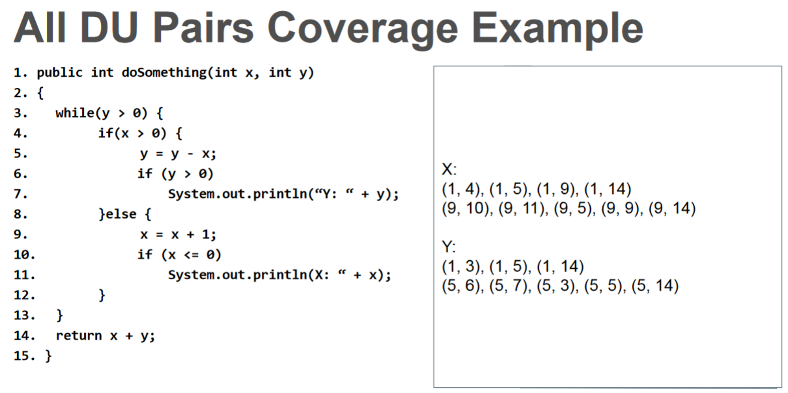
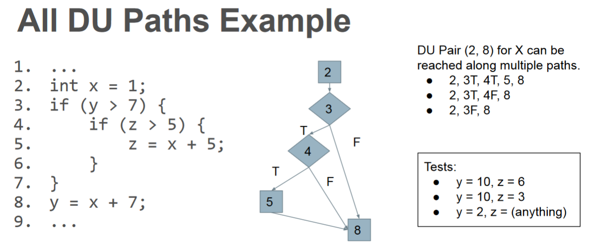
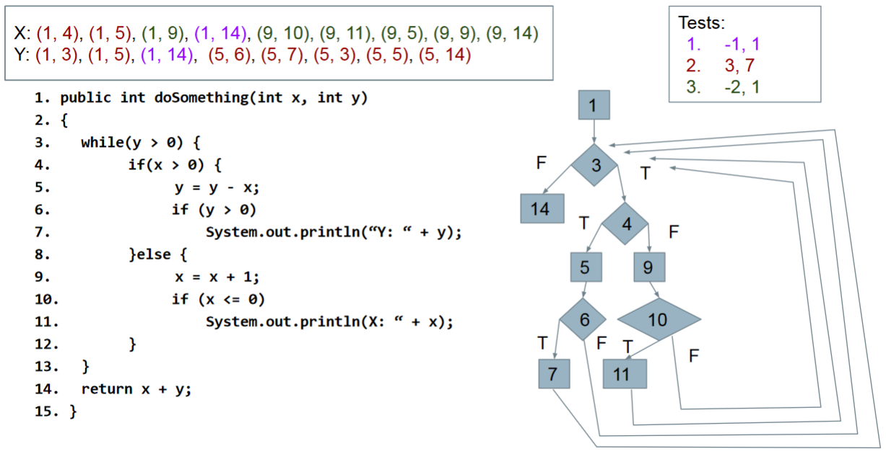
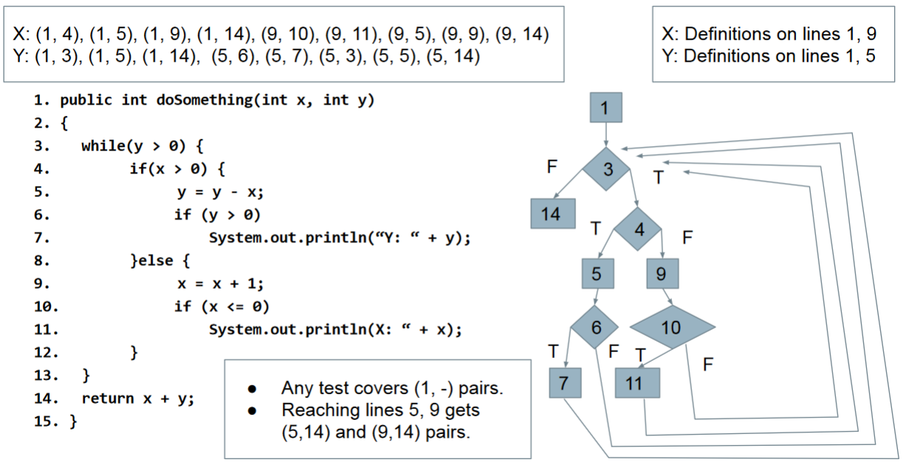

# Guide Version #2

---

## Software Testing

- An investigation into system quality.
- Based on sequences of stimuli and observations.
- Stimuli that the system must react to.
- Observations of system reactions.
- Verdicts on correctness.

## Verification

> “Are we building the product right?”

The process of proving that the software conforms to its specified functional and non-functional requirements.

- Is the implementation consistent with its specification?
- Does the software work under conditions we set? (usually based on requirements)

Verification is an experiment.
1. Perform trials
2. evaluate results
3. gather evidence.

*"Specification"* and *"implementation"* are roles.

> Usually source code & requirement specification. 

But also...
- Detailed design and high-level architecture.
- Design and requirements.
- Test cases and requirements.
- Source code and user manuals.

|Trade-offs|
|-|
|Pessimistic Inaccuracy - not guaranteed to program even if the it possesses X.|
|Optimistic Inaccuracy - may accept program that does not possess X.|
|Property Complexity - if X is too difficult to check, substitute simpler property Y.|

> We are interested in proving that a program demonstrates property X


## Validation

> “Are we building the right product?”

The process of proving that the software meets the customer’s true requirements, needs, and expectations.

- Does the product work in the real world?
- Does the software fulfill the users’ actual needs?
- Not the same as conforming to a specification.
- If we specify two buttons and implement all behaviors related to those buttons, we can achieve verification.
- If the user expected a third button, we have not achieved validation

# Verification & Validation

---

> V&V can start as soon as the project starts.
- Feasibility studies must consider quality assessment.
- Requirements can be used to derive test cases.
- Design can be verified against requirements.
- Code can be verified against design and requirements.
- Feedback can be sought from stakeholders at any time.

## Static Verification

> Analysis of system artifacts to discover problems.
- Proofs: Posing hypotheses and making arguments using specifications, models, etc.
- Inspections: Manual “sanity check” on artifacts (e.g., source code), searching for issues.

|Advantages|
|-|
|One error can hide other errors. Inspections not impacted by program interactions.|
|Incomplete systems can be inspected without special code to run partial system.|
|Inspection can assess quality attributes such as maintainability, portability, code style, program inefficiencies, etc.|


## Dynamic Verification

- Exercising and observing the system to argue that it meets the requirements.
- Testing: Formulating sets of input to demonstrate requirement satisfaction or find faults.
- Fuzzing: Generating semi-random input to locate crashes and other anomalies.
- Taint Analysis: Monitoring how faults spread by corrupting system variables.

|Advantages|
|-|
|Discovers problems from runtime interaction, timing problems, or performance issues.|
|Often cheaper than static verification.|
|Easier to automate.|
|However, cannot prove that properties are met|
|Cannot try all possible executions.|


## Perfect Verification and the Halting problem

> Verification is an instance of the halting problem.

- There is at least one program for which any technique cannot obtain an answer in finite time.
- Testing - cannot exhaustively try all inputs.
- Must accept some degree of inaccuracy.


# Bug, Defect, Error, Fault & Failure

---

## Bug

In software testing, a bug is the informal name of defects, which means that software or application is not working as per the requirement. When we have some coding error, it leads a program to its breakdown, which is known as a bug. The test engineers use the terminology Bug.

## Defect

When the application is not working as per the requirement is knows as defects. It is specified as the aberration from the actual and expected result of the application or software.

In other words, we can say that the bug announced by the programmer and inside the code is called a Defect.

## Error

The Problem in code leads to errors, which means that a mistake can occur due to the developer's coding error as the developer misunderstood the requirement or the requirement was not defined correctly. The developers use the term error.

## Fault

The fault may occur in software because it has not added the code for fault tolerance, making an application act up.

A fault may happen in a program because of the following reasons:
- Lack of resources
- An invalid step
- Inappropriate data definition


## Failure

Many defects lead to the software's failure, which means that a loss specifies a fatal issue in software/ application or in its module, which makes the system unresponsive or broken.

In other words, we can say that if an end-user detects an issue in the product, then that particular issue is called a failure.

Possibilities are there one defect that might lead to one failure or several failures.

For example, in a bank application if the Amount Transfer module is not working for end-users when the end-user tries to transfer money, submit button is not working. Hence, this is a failure.

|Comparison basis|Bug|Defect|Error|Fault (important)|Failure (important)|
|-|-|-|-|-|-|
|Definition|It is an informal name specified to the defect.|The Defect is the difference between the actual outcomes and expected outputs.|An Error is a mistake made in the code; that's why we cannot execute or compile code.|The problem that caused a failure. Mistake in the code, omission from, the code, misuse.|An execution that yields an incorrect result.|

# Software Quality

> Software quality is defined as to which degree a system satisfies the stated and implied needs of its various stakeholders, and thus provides value.

- internal quality

Internal quality has to do with the way that the system has been constructed. It is a much more granular measurement and considers things like clean code, complexity, duplication, component reuse. This quality can be measured through predefined standards, linting tools, unit tests etc. Internal quality affects your ability to manage and reason about the program.

Is your program able to cope with new requirements easily moving forward? Is your program efficient enough to deal with an inevitable increase in data volume? Is your domain logic decoupled from the framework so that it can be updated without breaking the system? Do you have tests to guard existing functionality?

These are some of the questions that need to be answered in order understand internal quality.

> There are two common aspects of quality: one of them has to do with the
> consideration of the quality of a thing as an objective reality independent of the 
> existence of man. The other has to do with what we think, feel or sense as a result 
> of the objective reality. In other words, there is a subjective side of quality.
– W. A. Shewhart

- external quality

External quality is the usefulness of the system as perceived from outside. It provides customer value and meets the product owner’s specifications. This quality can be measured through feature tests, QA and customer feedback. This is the quality that affects your clients directly, as opposed to internal quality which affects them indirectly.

## Quality Attributes
- Performance
  - Ability to meet timing requirements. When events occur, the system must respond quickly.
- Security
  - Ability to protect information from unauthorized access while providing service to authorized users.
- Scalability
  - Ability to “grow” the system to process more concurrent requests.
- Availability
  - Ability to carry out a task when needed, to minimize “downtime”, and to recover from failures.
- Modifiability
  - Ability to enhance software by fixing issues, adding features, and adapting to new environments.
- Testability
  - Ability to easily identify faults in a system.
  - Probability that a fault will result in a visible failure.
- Interoperability
  - Ability to exchange information with and provide functionality to other systems.
- Usability
  - Ability to enable users to perform tasks and provide support to users.
  - How easy it is to use the system, learn features, adapt to meet user needs, and increase confidence and satisfaction in usage.
- Resilience
- Supportability
- Portability
- Development Efficiency
- Time to Deliver
- Tool Support
- Geographic Distribution

## Methodology

> ISVV is usually composed by five principal phases, these phases can be executed sequentially or as results of a tailoring process.

- Planning

> Planning of ISVV activities
> System criticality analysis: Identification of critical components through a set of > RAMS activities (Value for Money)
> Selection of the appropriate methods and tools

- Requirements verification

> Verification for: completeness, correctness, testability

- Design verification

> Design adequacy and conformance to software requirements and interfaces
> Internal and external consistency
> Verification of feasibility and maintenance

- Code verification

> Verification for: completeness, correctness, consistency
> Code metrics analysis
> Coding standards compliance verification

- Validation

> Identification of unstable components/functionalities
> Validation focused on error-handling: complementary (not concurrent) validation regarding the one performed by the development team
> Compliance with software and system requirements
> Black box testing and White box testing techniques
> Experience based techniques

# Testing Measurement Scale

## Testing Percentages

> 70% of your tests.
- Unit tests verify behavior of a single class.

> 20% of your tests.
- System tests verify class interactions.

> 10% of your tests.
- GUI/exploratory tests verify end-to-end journeys.

## Testing
- 70/20/10 recommended.
- Unit tests execute quickly, relatively simple.
- System tests more complex, require more setup, slower to execute.
- UI tests very slow, may require humans.
- Well-tested units reduce likelihood of integration issues, making high levels of testing easier.

## Acceptance Types
> Alpha Testing
- A small group of users work closely with development team to test the software.
> Beta Testing
- A release of the software is made available to a larger group of interested users. 
> Formal Acceptance Testing
- Customers decide whether or not the system is ready to be released.

## Acceptance Testing Stages
- Define acceptance criteria
- Work with customers to define how validation will be  conducted, and the conditions that will determine acceptance.
- Plan acceptance testing
- Decide resources, time, and budget for acceptance testing. Establish a schedule. Define order that features should be tested. Define risks to testing process.
- Derive acceptance tests.
- Design tests to check whether or not the system is acceptable. Test both functional and non-functional characteristics of the system.
- Run acceptance tests
- Users complete the set of tests. Should take place in the same environment that they will use the software. Some training may be required.
- Negotiate test results
- It is unlikely that all of the tests will pass the first time. Developer and customer negotiate to decide if the system is good enough or if it needs more work.
- Reject or accept the system
- Developers and customer must meet to decide whether the system is ready to be released.

## Test Plans

> Plan for how we will test the system.

- What is being tested (units, subsystems, features).
- When it will be tested (required stage of completion).
- How it will be tested (what scenarios do we run?).
- Where we are testing it (types of environments).
- Why we are testing it  (what purpose do tests serve?).
- Who will be responsible for writing test cases (assign responsibility to team members).

## System Testing
- Tests the integration of units as a whole.
- Integrate units in one subsystem.
- Then integrate the subsystems.
- Test through a defined interface. 
- Focus on showing that functionality accessed through interfaces is correct.
- Subsystems: “Top-Level” Class, API
- System: API, GUI, CLI, ... Subsystem made up classes of A, B, and C. We have performed unit testing...
- Classes work together to perform subsystem functions.
- Tests applied to the interface of the subsystem they form.
- Errors in combined behavior not caught by unit testing.

### Unit vs System Testing
> Unit
- Unit tests focus on a single class.
- Simple functionality, more freedom.
- Few method calls.
> System
- System tests bring many classes together.
- Focus on testing through an interface.
- One interface call triggers many internal calls.
- Slower test execution.
- May have complex input and setup.

### Cyclomatic Complexity

Cyclomatic complexity of a code section is the quantitative measure of the number of linearly independent paths in it. It is a software metric used to indicate the complexity of a program. It is computed using the Control Flow Graph of the program. The nodes in the graph indicate the smallest group of commands of a program, and a directed edge in it connects the two nodes i.e. if second command might immediately follow the first command. 

For example, if source code contains no control flow statement then its cyclomatic complexity will be 1 and source code contains a single path in it. Similarly, if the source code contains one if condition then cyclomatic complexity will be 2 because there will be two paths one for true and the other for false. 

Mathematically, for a structured program, the directed graph inside control flow is the edge joining two basic blocks of the program as control may pass from first to second. 

```java
// So, cyclomatic complexity M would be defined as, 
M = E – N + 2P
where,
E = the number of edges in the control flow graph
N = the number of nodes in the control flow graph
P = the number of connected components
```

#### Use of Cyclomatic Complexity: 

    Determining the independent path executions thus proven to be very helpful for Developers and Testers.
    It can make sure that every path have been tested at least once.
    Thus help to focus more on uncovered paths.
    Code coverage can be improved.
    Risk associated with program can be evaluated.
    These metrics being used earlier in the program helps in reducing the risks.

> Advantages of Cyclomatic Complexity:.
- It can be used as a quality metric, gives relative complexity of various designs.
- It is able to compute faster than the Halstead’s metrics.
- It is used to measure the minimum effort and best areas of concentration for testing.
- It is able to guide the testing process.
- It is easy to apply.
> Disadvantages of Cyclomatic Complexity:
- It is the measure of the programs’s control complexity and not the data the data complexity.
- In this, nested conditional structures are harder to understand than non-nested structures.
- In case of simple comparisons and decision structures, it may give a misleading figure.


## Explore Relationshops

In layman terms, exploratory testing involves concurrent test case design and test execution of an application or system under test. The tester will create or write down a test idea to give direction, and explore the system while testing to further create critical, practical and useful tests for the successful testing of an application.

This requires minimal planning. Testers continuously make a decision on her next step of action. It completely depends upon the tester’s thought process.

Sometimes this testing can be more beneficial than the formal testing approach for finding some subtle defects which go missing in formal testing.

Consciously or unconsciously each and every tester would have done exploratory testing at some point in their career.

As we all know, a learner will learn better through hands-on experience rather than cramming the theory.

Same way, a tester will know the application better only while exploring and learning about all the functionality it provides by itself. It is always good to have a customer and business perspective while testing to ensure successful testing of an application.

> Exploratory testing typically is guided by “tours”. Each tour describes a different way of thinking about the system-under-test, and prescribes how the tester should act when they explore the functionality of the system.

### Exploratory Tours

> Features split into “districts” based on type and how we test. Business = core functionality, Seedy = security aspects, “Tours” related to each district. Each prescribes a way of exploring the software.

> Business District
- Most important features.
- The functionality that will get users to buy software.
- Tours focus on features that are used most often.
- Guidebook Tour: Focuses on common user journeys, covered in user manuals and tutorials.
- Fed-Ex Tour: Focuses on how data is passed and transformed between these features.

> Guidebook Tour
- Cities advertise top attractions, and ensure they are clean and safe.
- Software offers user manuals and tutorials, illustrating step-by-step use of features.
- Follow tutorials and execute each step.
- Tests both functionality and accuracy of tutorials.
- If software and tutorial do not match, report an issue.

> Guidebook Variants
- “Blogger’s Tour”
- Follow guides and scenarios from StackOverflow,blogs, books, other tutorials.
- “Pundit’s Tour”
- Create tests based on complaints.
- Try to reproduce their issues.
- “Competitor’s Tour”
- Perform tour on competing products and their guides.
- Identify potential improvements to your system.

> Fed-Ex Tour
- When a package is sent, it is handled by many people and passes through many locations.
- In software, data is passed, transformed, and passed again before output appears.
- Examine how data is manipulated.
- Validate data after operations.
- Look at serialization/deserialization.
- (ex: how does shopping site handle mailing addresses?)

#### Fed-Ex Tour Example
- Test Case Management System
- Client app pulls “work items” from a server and displays it in GUI for manipulation.
- Test cases, bug reports
- Relies on server connection for almost all functionality.
- Many clients can modify same work items concurrently.

> Historic District
- Historic districts contain important old buildings.
- In software, these are older features still in use.
- Tours verify that they still work and are fault-free.
- Bad Neighborhood Tour: Ensure that faulty code now
works, and that fixes did not introduce new faults.
- Museum Tour: Ensure that unchanged code still works as intended.

> Bad Neighborhood Tour
- Complex features may have had many faults fixed over time.
- Focus on those features and ensure that:
- Reported faults have actually been fixed.
- New faults have not been introduced or uncovered.
- Also check related features for introduced faults.

> Museum Tour
- Older features may not have been modified or retested recently.
- Verify that old code still works in the current system.
- Check modification dates in repository, and ensure oldest elements are retested.
- Such elements often lack tests, are hard to modify, not tested up to current standards.

> Entertainment District
- Entertainment districts fill in the gaps in a vacation when you want to relax.
- In software, this represents supporting features that aren’t part of critical functionality.
- Word processor: Making document look nice.
- Tours visit supporting features and ensures they are properly intertwined with core features.
- Supporting Actor: Features on-screen with core features
- All-Nighter Tour: Run the software for a long time.

> Supporting Actor Tour
- Many features might be linked to a core feature.
- When we search for a product (core feature), we see “reviews” and “similar items” (non-core features).
- Focus testing on features that share the screen with core features.
- Will be used often.
- Make sure they can be accessed from the core feature.

> Tourist District
- Captures the experience of being a tourist - visit functions quickly and avoid deep inspection of individual features.
- Souvenir Tour: Run quick tests on functions, examine actions and identify gaps, plan round 2.
- Supermodel Tour: Test the GUI thoroughly, look for GUI errors, inconsistencies, usability errors.

> Supermodel Tour
- Ignore the functionality and focus on the GUI.
- As you try different functions:
- Does GUI render properly and quickly?
- Are transitions clean?
- Are colors and styles used consistently?
- Is GUI usable and accessible by those with dyslexia or colorblindness?

### Supermodel Tour Example

- Dynamics AX Client
- Resource planning system acquired by Microsoft.
- Shift from APIs to heavy GUI development.
- Led to take-up of exploratory testing.
- Found MANY bugs missed by API tests.
- Many new scenarios and interactions not considered before.
- Testers learned that they knew very little about their own app.
- Now: exploratory testing before new features merged.
- Actions that exposed DynamicAX issues:
- Modify OS settings (brightness/contrast/resolution) and verify the elements display properly.
- Access remotely and look for flickering or bad rendering.
- Run with multiple monitors.
- Combine with Supporting Actor Tour:
- Open pop-up, but look for GUI issues around pop-up.
- Appearance faults often have major impact on user perception of the program.

#### Windows Phone

- Mobile OS
- Always connected, supports mobile, bluetooth, WiFi
- Must consider memory, battery life, CPU speed, bandwidth.
- Anyone can release apps that can cause potential issues on a device.
- Set to an uncommon screen resolution.
- Navigated to different calendar views.
- When selecting a month, the month “view” was centered when it should have been top-justified.
- Missing flag for screen resolution in this view.
- Usability of Maps application.
- Device knows current location, but does not use it as default when “Location A” field left blank.
- Not a bug, but fixing would improve user experience.

#### Windows Media Player
- Media player.
- Sync, burn, rip, play many media types.
- UI-centric application.
- Inputs are text, check boxes,
option icons, disc icons.
- Output is audio, video, dialog boxes.
- Supermodel tour gave most rapid results to testers.
- Many typographical mistakes found early in development.
- Look at text and read slowly.
- (count to two before going to the next word)
- Not *serious*, but can harm your reputation.

> Hotel District
- Return to hotel to take a break.
- Focuses on secondary and supporting usage scenarios.
- Software “at rest” can be very busy.
- Rained Out Tour: Cancel running operations and see if problems are caused.
- Couch Potato Tour: Leave fields blank and use default values to assess ability to process partial information.

> Rained-Out Tour
- Look for operations that can be cancelled.
- Cancel midway through, see if everything still works.
- Good for finding failures related to the program’s inability to clean up after itself.
- Open files, corrupted memory or state.
- Even if there is no cancel button, can click back button or close entirely.

#### Rained-Out Tour Example
- DynamicsAX
- Change the state of the software before cancelling.
- Opened a pop-up within a form, then closed the form while pop-up was open.
- App crashed because pop-up was still open.
- After opening “User Setup” form, they left it open and switched to a different module.
- Crash when they clicked Setup form’s cancel button.

- Reattempt scenario after cancelling.
- New feature ensures that creates/updates/deletes for joined data occur within a single operation.
- Cancel changes by clicking “Restore” button on toolbar.
- Changes discarded and replaced by values in database.
- Reattempted to update same record, leading to crash.

- Test Case Management System
- Interrupted server requests and refresh actions can lead to issues.
- Bug 1: Canceled initial connection to project. No longer able to manually connect to it.
- Bug 2: Switching test suites during loading does not stop loading of the original suite.
- Bug 3: Clicking refresh button several times causes slowdown, as each refresh is handled (not just the latest).

> Windows Phone
- Search for contact
- Loaded > 4000 contacts. While searching, they changed the search string.
- Changed filter clashed with original filter, incorrect results.
- Bluetooth Connection
- If focus shifts while connecting to device, can try to connect again
- Multiple connection requests will be sent.
- Device functions once connected, but multiple failure notices come back.

> Couch Potato Tour
- Tester does least interaction possible.
- Leave default values in place, leave input fields blank, try to move forward without offering much data.
- Ensures software must execute code for processing blank or partial information and defaults.
- We try so many complicated scenarios that we can miss or forget the defaults.

> Seedy District
- Focused on attacking and breaking the system.
- Saboteur Tour: Directly attack software via malformed input or resource manipulation.
- Antisocial Tour: Try unlikely input or perform actions in the wrong order.
- (add 10000 songs, try to play empty playlist,order 10000000 pairs of shoes)

> Saboteur Tour
- Force the software to act.
- Understand the resources it requires to successfully act.
- Remove of restrict those resources.
- Use corrupt input data, limit network connectivity, allow too little RAM, run many other apps at the same time.
- Think of ways to creatively disrupt operations and try them out.

#### Saboteur Tour Example

- Test Case Management System
- Change or remove necessary resources.
- Bug 1: System crashes if connection to data server is closed at different points.
- Bug 2: System crashes, restarts, crashes again, etc. if the config file is corrupted.
- Bug 3: System crashes if config file is too large.
- (also try making it read-only, changing file type, deleting)

> Windows Phone
- Contact lists linked to call history, speed dial, texts, etc.
- Delete linking database between contacts and speed dial.
- Contacts still on device, so phone thinks data is synced.
- However, speed dial is empty.
- Airplane mode may not be accounted for.
- IM client loses connection when airplane mode turned on.
- However, does not realize it was disconnected.
- User can still attempt to use client when nothing will work.

## Confirming a theory

measurement data can be useful for confirming a theory.

## Complexity and Technical Debt

If you simply consider brute-force algorithms and their computational complexities (mostly intuitive, straightforward, easy, and obvious) in comparison to their more efficient and advanced counterparts (less intuitive and obvious) it should be easy to see the dilemma in building software. Oftentimes the most efficient way of building a software system isn’t the most intuitive or obvious choice.

Engineering teams are often required to deliver new products and features very quickly and so it is easy to choose a coding solution that is simple and quick. In many cases, though, there may be a more advanced and time-consuming option that would be better suited for the task, and save unnecessary maintenance costs down the road.

> Can technical debt be calculated?
There are many metrics to consider when determining code quality. Some of these include complexities (cyclomatic and cognitive), lines of code, arity, maintainability index, Halstead complexity measures, depth of inheritance, afferent and efferent couplings, nesting depth, time to write n lines, etc. Technical debt computation is important, but it can be confusing to know how much work is needed to eliminate with so many contributing factors. However, there is a simple solution. By expressing the problem correctly, an easy solution can be determined:

A simple ratio can show the technical debt as a relationship between the cost to fix the software system (Remediation Cost) and the cost of developing it (Development Cost). The term used to describe this equation is the Technical Debt Ratio (TDR):

Technical Debt Ratio = (Remediation Cost / Development Cost) x 100%

## Robust Equivalence-Class Testing

> Advangtages
- helps reduce the number of test cases, without compromising the test coverage.
- reduces the overall test execution time as it minimizes the set of test data.
- enables the testers to focus on small data sets, which increases the probability of uncovering more defects in the software product.
- used in cases where performing exhuastive testing is difficult.

> Disadvantages
- it does not consider the conditions for boundary value
- the identification of equivalence classes relies heavily on the expertise of testers.
- testers might assume that the output for all input data is correct, which can become a great hurdle in testing.

## All-Uses Coverage Criterion

- All DU Pair Coverage
  - Requires each DU pair be exercised in at least one program execution.
  - Cover any path between a definition and its use

  > Coverage = number_exercised_DU_pairs / number_of_DU_pairs

  - Can easily achieve structural coverage without covering all DU pairs.

</img>

### example
```java
public int doSomething(int x, int y) 
{
  while(y > 0) {
  if(x > 0)
  { 
    y = y - x;
    if (y > 0) 
    System.out.println(“Y: “ + y);
  }
  else
  {
    x = x + 1;
    if (x <= 0)
    {
      System.out.println(X: “ + x);
    }
  }
  return x + y;
}

/*

  X: 
  (1, 4), (1, 5), (1, 9), (1, 14)
  (9, 10), (9, 11), (9, 5), (9, 9), (9, 14)

  Y:
  (1, 3), (1, 5), (1, 14)
  (5, 6), (5, 7), (5, 3), (5, 5), (5, 14)

*/
```

- All DU Paths Coverage

  - A use may be reachable along several paths from the definition. 
  - Cover all simple (non-looping) paths at least once.
  - Can reveal faults where a path is exercised that should use a certain definition but doesn’t. 

> Coverage = number_of_exercised_DU_paths / number_of_DU_paths

</img>
</img>

- All Definitions Coverage
  - All DU Pairs/All DU Paths may be too expensive in some situations.
  - Pair each definition with at least one use.
  - Skips many DU pairs, but ensures each definition tried.

> Coverage = number_of_covered_definitions / number_of_definitions

</img>

> Varying power and cost.

## Equivalence Class Testing

https://www.geeksforgeeks.org/equivalence-class-testing-next-date-problem/

> The equivalence class testing can be categorized into four different types, which are integral part of testing and cater to different data set. These types of equivalence class testing are:

- Weak Normal Equivalence Class Testing: In this first type of equivalence class testing, one variable from each equivalence class is tested by the team. Moreover, the values are identified in a systematic manner. Weak normal equivalence class testing is also known as single fault assumption.
- Strong Normal Equivalence Class Testing: Termed as multiple fault assumption, in strong normal equivalence class testing the team selects test cases from each element of the Cartesian product of the equivalence. This ensures the notion of completeness in testing, as it covers all equivalence classes and offers the team one of each possible combinations of inputs.
- Weak Robust Equivalence Class Testing: Like weak normal equivalence, weak robust testing too tests one variable from each equivalence class. However, unlike the former method, it is also focused on testing test cases for invalid values.
- Strong Robust Equivalence Class Testing: Another type of equivalence class testing, strong robust testing produces test cases for all valid and invalid elements of the product of the equivalence class. However, it is incapable of reducing the redundancy in testing.

## minimum number of required test cases
1) Weak normal equivalence class testing
2) Weak robust equivalence class testing
3) Strong normal equivalence class testing
4) Strong robust equivalence class testing

## classification tree & decision table

<h1 style="color:red;">TODO</h1>

## control-flow graph
https://www.geeksforgeeks.org/software-engineering-control-flow-graph-cfg/


## Calculate all prime paths of the control-flow graph

<h1 style="color:red;">TODO</h1>

## A/B testing

> A/B testing, also known as split testing, refers to a randomized experimentation process wherein two or more versions of a variable (web page, page element, etc.) are shown to different segments of website visitors at the same time to determine which version leaves the maximum impact and drive business metrics.

## mutation testing

>
### Goals

> The goals of mutation testing are multiple:

identify weakly tested pieces of code (those for which mutants are not killed)
identify weak tests (those that never kill mutants)
compute the mutation score, the mutation score is the number of mutants killed / total number of mutants.
learn about error propagation and state infection in the program

### operators

Many mutation operators have been explored by researchers. Here are some examples of mutation operators for imperative languages:

- Statement deletion
- Statement duplication or insertion, e.g. goto fail;
- Replacement of boolean subexpressions with true and false
- Replacement of some arithmetic operations with others, e.g. + with *, - with /
- Replacement of some boolean relations with others, e.g. > with >=, == and <=
- Replacement of variables with others from the same scope (variable types must be compatible)
- Remove method body, implemented in Pitest

- Relational operator replacement (ror)
- Arithmetic operator replacement (aor)
- Constant for constant replacement (crp)

### types of mutatants

• “First-Order Mutants” (our focus)
  • One line modified.
  • Easy to create, many tools to insert them.
  • Most common, but not as realistic.
• “Higher-Order Mutants”
  • Multiple lines modified.
  • Harder to create, not well understood.
  • May be more realistic.

### Mutant Quality

To be used in testing, mutants must be:
• Syntactically correct (valid)
  • Mutants must compile and execute.
• Plausible (useful)
  • Must provide valuable information on how the system works for testers working to improve the system.
• A mutant can be valid, but not useful.
  • All or almost all tests fail.

# Control Flow Graph
https://www.youtube.com/watch?v=0lVA7TPpxUE


## concept of capture and recapture, used in code inspections.

<h1 style="color:red;">TODO</h1>

## test-driven development process.

<h1 style="color:red;">TODO</h1>

## strengthes & weaknesses of test-driven development.

<h1 style="color:red;">TODO</h1>

## goal-question-metric approach

<h1 style="color:red;">TODO</h1>

## GQM-graph

<h1 style="color:red;">TODO</h1>

## inspection procedure according to Fagan (1976)

<h1 style="color:red;">TODO</h1>

## DU pairs

<h1 style="color:red;">TODO</h1>

## Quality Scenarios

<h1 style="color:red;">TODO</h1>

## Structural Testing

<h1 style="color:red;">TODO</h1>

## Data Flow Testing

<h1 style="color:red;">TODO</h1>

## random ascent

<h1 style="color:red;">TODO</h1>

# unit testing, system testing, GUI testing, exploratory testing, or acceptance testing

<h1 style="color:red;">TODO</h1>

## Finite State Verification
Temporal Operators: A quick reference list.
● G p: p holds globally at every state on the path
● F p: p holds at some state on the path
● X p: p holds at the next (second) state on the path
● p U q: q holds at some state on the path and p holds at every state before the first state at which q holds.
● A: for all paths from a state, used in CTL as a modifier for the above properties (for example, AG p)
● E: for some path from a state, used in CTL as a modifier for the above properties (for example, EF p)

## random ascent

<h1 style="color:red;">TODO</h1>

## ++Coverage (MC, DC, DU...)

<h1 style="color:red;">TODO</h1>

## ++Quality equations (POF, ROF, MTBF...)

<h1 style="color:red;">TODO</h1>

## Finite state verification
    +Safety properties - LTL/CTL 
    +Liveness properties - LTL/CTL